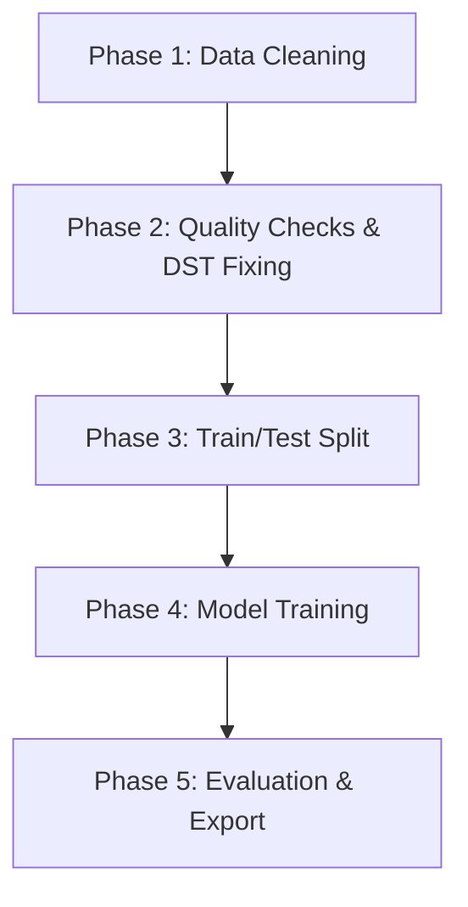

# 📋 Entwicklungsplan - Strombedarfsprognose Österreich

Dieser Entwicklungsplan dokumentiert den chronologischen Entwicklungsprozess der .NET 8 Konsolenanwendung zur stündlichen Vorhersage des österreichischen Stromverbrauchs mittels Singular Spectrum Analysis (SSA) und ML.NET.

---

## 🎯 Projektziele und Motivation

### Hauptziel
Entwicklung einer robusten Zeitreihenprognose für den stündlichen Stromverbrauch in Österreich mit einem Vorhersagehorizont von 24 Stunden.

### Technische Anforderungen
- **.NET 8** als Zielframework für moderne C#-Features
- **ML.NET** (v5.0.0) für maschinelles Lernen
- **Univariate Zeitreihenanalyse** ohne externe Features (z.B. Wetter)
- **Deterministisches, reproduzierbares** Training
- **Plattformunabhängige** Ausführung

### Datenquelle
Stündliche Stromverbrauchsdaten von [E-Control Austria](https://www.e-control.at/statistik/e-statistik/data) im CSV-Format, Zeitraum 2016-2025.

---

## 🏗️ Projektarchitektur

Die Anwendung wurde als sequentielle Pipeline mit 5 Hauptphasen konzipiert, die nacheinander in `Program.cs` ausgeführt werden. [0-cite-0](#0-cite-0) 



---

## 📦 Phase 0 - Projektgrundlage und Abhängigkeiten

### Projektstruktur
Das Projekt wurde als .NET 8 Konsolenanwendung mit folgender Ordnerstruktur angelegt:
- `Data/` - Eingabe- und Ausgabedateien (CSV)
- `Models/` - C# Datenmodelle und trainiertes ML-Modell

### NuGet-Abhängigkeiten
Zwei zentrale Pakete wurden verwendet:
- **Microsoft.ML** (5.0.0) - Kern ML.NET Framework
- **Microsoft.ML.TimeSeries** (5.0.0) - Zeitreihenalgorithmen inkl. SSA

### Datenmodelle
Zwei einfache DTOs wurden für die ML.NET Pipeline definiert:

**ModelInput**: Repräsentiert eine Zeile der bereinigten CSV-Daten mit Zeitstempel und Stromverbrauch (MW). [0-cite-1](#0-cite-1) 

**ModelOutput**: Repräsentiert die SSA-Prognoseergebnisse als Arrays mit Prognosewerten und 95%-Konfidenzintervallen. [0-cite-2](#0-cite-2) 

---

## 🧹 Phase 1 - Data Cleaning (Datenbereinigung)

### Problem
Die Rohdatei `el_dataset_h.csv` von E-Control enthält:
- **14 Metadaten-Zeilen** am Anfang (Header, Einheiten, Beschreibungen)
- **Komma als Dezimaltrennzeichen** (z.B. `6104,931`)
- **Mehrere Spalten** - nur Spalte 9 ("Stromverbrauch") ist relevant
- **Anführungszeichen** um Werte
- **Leere Werte** in manchen Zeilen

### Lösung
Die Methode `CleanData()` wurde implementiert, um eine konsistente 2-Spalten-CSV zu erzeugen. [0-cite-3](#0-cite-3) 

### Implementierungsdetails

**Metadaten-Überspringen**: Die Methode erkennt den Beginn der eigentlichen Daten durch einen Zeitstempel-Prefix (`"2016-"`). [0-cite-4](#0-cite-4) 

**Dezimaltrennzeichen-Konvertierung**: Komma wird durch Punkt ersetzt, um `InvariantCulture`-Parsing zu ermöglichen. [0-cite-5](#0-cite-5) 

**Validierung**: Sowohl Zeitstempel als auch Stromverbrauchswerte werden validiert, ungültige Zeilen werden übersprungen. [0-cite-6](#0-cite-6) 

**InvariantCulture**: Alle DateTime- und Float-Operationen verwenden `CultureInfo.InvariantCulture`, um plattformunabhängige Ausführung zu garantieren (z.B. auf deutschen Systemen mit Komma-Dezimaltrenner). [0-cite-7](#0-cite-7) 

### Output
- Datei: `Data/el_power_clean.csv`
- Format: `Timestamp;Stromverbrauch` (2 Spalten, Semikolon-getrennt)
- Verarbeitete Zeilen: ~85.463 gültige Records (2016-2025)

### Warum diese Herangehensweise?
- **Transparenz**: Jede Transformationsstufe erzeugt eine eigene Datei (non-destructive)
- **Debugging**: Zwischenschritte sind inspizierbar
- **Konsistenz**: Punkt als Dezimaltrenner vermeidet Parsing-Fehler in ML.NET

---

## ✅ Phase 2 - Quality Checks & DST Fixing (Qualitätsprüfung & Zeitumstellungskorrektur)

Diese Phase ist in zwei Teile gegliedert: Qualitätsprüfung und DST-Korrektur.

### Teil A: Qualitätsprüfung (`PerformQualityChecks`)

Die Methode führt umfassende Integritätsprüfungen durch. [0-cite-8](#0-cite-8) 

**Zeitstempel-Integrität**:
- Monotonie-Prüfung (aufsteigende Zeitreihenfolge)
- Duplikat-Erkennung
- Lücken-Detektion zwischen aufeinanderfolgenden Zeitstempeln [0-cite-9](#0-cite-9) 

**Wert-Integrität**:
- NaN/Infinity-Erkennung
- Negative Werte (physikalisch unmöglich)
- Zero-Werte (ungewöhnlich, aber möglich) [0-cite-10](#0-cite-10) 

**Statistische Analyse**:
- Min/Max/Mean/StdDev zur Erkennung von Ausreißern [0-cite-11](#0-cite-11) 

**Concept Drift Awareness**:
Die Methode analysiert auch die zeitliche Verteilung der Daten für spätere Train/Test-Splits. [0-cite-12](#0-cite-12) 

### Teil B: DST-Korrektur (`HandleDstDuplicatesAndGaps`)

### Problem: Zeitumstellung (Daylight Saving Time)
Die Umstellung zwischen Sommer- und Winterzeit verursacht zwei Arten von Anomalien in Zeitreihen:

1. **Oktober (Uhren zurück)**: Die Stunde 02:00-03:00 existiert zweimal
   - Erste 02:00 vor Umstellung (MESZ)
   - Zweite 02:00 nach Umstellung (MEZ)
   - **Resultat**: Doppelte Zeitstempel in den Daten

2. **März (Uhren vor)**: Die Stunde 02:00-03:00 wird übersprungen
   - **Resultat**: Lücke in der Zeitreihe

### Warum ist das kritisch für ML?
ML.NET's SSA-Algorithmus erwartet eine **lückenlose, monotone Zeitreihe** ohne Duplikate. Verletzungen dieser Annahme führen zu Fehlern oder verfälschten Prognosen.

### Lösung: Zweistufige Korrektur

**Schritt 1: Oktober-Duplikate behandeln**
Duplikate werden gruppiert und durch ihren **Mittelwert** ersetzt, um die Monotonie zu wahren. [0-cite-13](#0-cite-13) 

**Rationale**: Die Mittelwertbildung ist physikalisch sinnvoll, da der tatsächliche Verbrauch während der doppelten Stunde irgendwo zwischen den beiden gemessenen Werten liegt.

**Schritt 2: März-Lücken füllen**
Fehlende Stunden werden durch **lineare Interpolation** der Nachbarwerte gefüllt. [0-cite-14](#0-cite-14) 

Die Interpolationslogik berechnet den Durchschnitt der Stunden vor und nach der Lücke. [0-cite-15](#0-cite-15) 

**Rationale**: Lineare Interpolation ist eine konservative Methode, die keine komplexen Annahmen über das Lastprofil macht und typischerweise nur eine einzige Stunde pro Jahr betrifft.

**Schritt 3: Finale Validierung**
Nach der Korrektur wird die Zeitreihe erneut auf Lücken und Duplikate geprüft. [0-cite-16](#0-cite-16) 

### Output
- Datei: `Data/el_power_clean_dstfixed.csv`
- Garantien: Keine Lücken, keine Duplikate, strikt monoton
- Typische Korrekturen: ~10 März-Lücken, ~9 Oktober-Duplikate (pro Jahr)

---

## ✂️ Phase 3 - Train/Test Split (Temporale Aufteilung)

### Problem: Concept Drift in Energiedaten
Stromverbrauchsmuster ändern sich im Laufe der Zeit durch:
- **Technologische Trends**: E-Mobilität, Wärmepumpen, Smart Homes
- **Politische Ereignisse**: COVID-19 Lockdowns
- **Wirtschaftliche Faktoren**: Industrieverlagerungen

Ältere Daten (z.B. 2016-2022) repräsentieren möglicherweise **veraltete Muster**, die für Prognosen in 2024/2025 nicht mehr relevant sind.

### Lösung: Strikte temporale Splits
Die Methode `CreateTrainTestFiles()` implementiert eine strikte temporale Aufteilung. [0-cite-17](#0-cite-17) 

**Trainingsperiode**: 30.09.2023 00:00 bis 29.09.2024 23:00 (genau 1 Jahr)
**Testperiode**: 30.09.2024 00:00 bis 29.09.2025 23:00 (genau 1 Jahr)

Die Zeitgrenzen werden strikt definiert und gefiltert. [0-cite-18](#0-cite-18) 

### Warum nur das letzte Jahr für Training?
- **Recency Bias**: Neuere Daten sind relevanter für zukünftige Prognosen
- **Concept Drift Mitigation**: Vermeidung veralteter Muster
- **Schaltjahr-Handling**: 2024 ist ein Schaltjahr (8784 Stunden statt 8760)

### Warum keine zufälligen Splits?
Bei Zeitreihen würde ein zufälliger Split **Data Leakage** verursachen: Das Modell könnte zukünftige Werte "sehen", bevor es sie prognostiziert. Temporale Splits respektieren die kausale Ordnung.

### Output
- `Data/train_data.csv` (8784 Records für Schaltjahr 2023-2024)
- `Data/test_data.csv` (8760 Records für 2024-2025)
- Physische Dateien ermöglichen externe Validierung

---

## 🧠 Phase 4 - Model Training (SSA-Modelltraining)

### Algorithmenwahl: Warum SSA?

**Singular Spectrum Analysis (SSA)** wurde gegenüber anderen Algorithmen (LSTM, Prophet, ARIMA) gewählt aus folgenden Gründen:

1. **Univariate Fokussierung**: SSA benötigt keine externen Features (Wetter, Feiertage)
2. **Determinismus**: Gleiche Eingabe → gleiche Ausgabe (kein Dropout, kein stochastisches Training)
3. **Schnelles Training**: Minuten statt Stunden/Tage
4. **Transparente Dekomposition**: Zerlegt Zeitreihen in Trend + Saisonalität + Rauschen
5. **ML.NET Native Support**: Direkt in `Microsoft.ML.TimeSeries` integriert

### SSA-Parameterkonfiguration

Die Methode `TrainModel()` konfiguriert die SSA-Pipeline mit folgenden Parametern. [0-cite-19](#0-cite-19) 

**Window Size (168 Stunden = 7 Tage)**:
- Erfasst den **wöchentlichen Zyklus** (Montag-Sonntag)
- Unterschiedliche Lastprofile an Werktagen vs. Wochenende [0-cite-20](#0-cite-20) 

**Series Length (720 Stunden = 30 Tage)**:
- Erfasst den **monatlichen Kontext**
- Sollte größer als `windowSize` sein (Faustregel: 2-5x) [0-cite-21](#0-cite-21) 

**Train Size (dynamisch berechnet)**:
- Verwendet **alle verfügbaren Trainingsdaten** (~8784 für Schaltjahr)
- Muss ≥ `seriesLength` sein
- Wird zur Laufzeit aus der tatsächlichen Datenmenge berechnet [0-cite-22](#0-cite-22) 

**Forecast Horizon (24 Stunden)**:
- Prognosezeitraum: nächste 24 Stunden
- Balance zwischen Nützlichkeit und Genauigkeit [0-cite-23](#0-cite-23) 

**Confidence Level (95%)**:
- Berechnet untere und obere Prognose-Schranken
- Ermöglicht Unsicherheitsquantifizierung [0-cite-24](#0-cite-24) 

### Warum dynamische Train Size?
2024 ist ein Schaltjahr (366 Tage = 8784 Stunden). Eine hart-codierte Train Size von 8760 würde 24 Stunden "verschenken". Die dynamische Berechnung maximiert die genutzten Daten. [0-cite-22](#0-cite-22) 

### Training und Speicherung
Das Modell wird mit `Fit()` trainiert und als `.zip`-Datei gespeichert. [0-cite-25](#0-cite-25) 

### Output
- `Models/forecast_model.zip` (trainiertes ML.NET Modell)
- Trainingsdauer: Typischerweise < 5 Minuten

---

## 📊 Phase 5 - Evaluation & Export (Bewertung und Ergebnisexport)

### Evaluationsmetriken

Die Methode `EvaluateAndExport()` berechnet zwei Standard-Zeitreihenmetriken. [0-cite-26](#0-cite-26) 

**Mean Absolute Error (MAE)**:
- Durchschnittliche absolute Abweichung zwischen Prognose und Ist-Wert
- Einfach interpretierbar in MW
- Weniger sensitiv gegenüber Ausreißern als RMSE [0-cite-27](#0-cite-27) 

**Root Mean Squared Error (RMSE)**:
- Wurzel der mittleren quadrierten Abweichung
- Bestraft große Fehler stärker (quadratisch)
- Standard-Metrik in ML.NET Tutorials [0-cite-28](#0-cite-28) 

**Relative Fehler**:
Beide Metriken werden auch als Prozentsatz des mittleren Stromverbrauchs angegeben, um die Größenordnung einzuordnen. [0-cite-29](#0-cite-29) 

### Ergebnisse
Die aktuelle Implementierung erreicht:
- **MAE**: 261.16 MW (~3.92% relativer Fehler)
- **RMSE**: 339.40 MW (~5.09% relativer Fehler)
- **Mean Load**: 6662.50 MW

Diese Werte sind für eine **univariate Prognose ohne Wetterdaten** als sehr gut einzustufen.

### CSV-Export für Analysen

Die Methode exportiert eine detaillierte CSV mit 5 Spalten für jeden Zeitstempel:
- `Timestamp`: Zeitpunkt der Prognose
- `Actual_Consumption`: Tatsächlicher gemessener Verbrauch
- `Forecast_Value`: Prognostizierter Wert
- `Lower_Bound`: Untere 95%-Konfidenzgrenze
- `Upper_Bound`: Obere 95%-Konfidenzgrenze [0-cite-30](#0-cite-30) 

**Negative Lower Bounds**: Die untere Konfidenzgrenze wird auf 0 begrenzt, da negativer Stromverbrauch physikalisch unmöglich ist. [0-cite-31](#0-cite-31) 

### Output
- `Data/evaluation_details.csv` (Excel-kompatibel)
- Verwendbar für Visualisierungen in Excel, PowerBI, Tableau, etc.

---

## 🔑 Wichtige technische Entscheidungen (Zusammenfassung)

### 1. Dezimaltrennzeichen-Konsistenz
**Problem**: CSV-Dateien von E-Control verwenden Komma, ML.NET erwartet Punkt.
**Lösung**: Strikte Verwendung von `CultureInfo.InvariantCulture` in allen Parsing- und Formatierungsoperationen.
**Vorteil**: Plattformunabhängige Ausführung (funktioniert auf de-DE, en-US, etc.)

### 2. Non-Destructive Pipeline
**Entscheidung**: Jede Phase erzeugt eine neue Ausgabedatei, statt vorhandene zu überschreiben.
**Dateien**: `el_power_clean.csv` → `el_power_clean_dstfixed.csv` → `train_data.csv` / `test_data.csv`
**Vorteil**: Nachvollziehbarkeit, Debugging, Rollback-Möglichkeit

### 3. DST-Korrektur statt Ignorierung
**Problem**: Zeitumstellungen verursachen Duplikate/Lücken.
**Alternative Ansätze**: Zeilen löschen, UTC verwenden, DST ignorieren
**Gewählte Lösung**: Intelligente Korrektur (Mittelwert/Interpolation)
**Begründung**: Minimaler Datenverlust, physikalisch sinnvoll, ML-kompatibel

### 4. Concept Drift Prevention
**Problem**: Ältere Daten repräsentieren veraltete Verbrauchsmuster.
**Lösung**: Training nur auf dem letzten Jahr (2023-2024), ältere Daten verworfen.
**Trade-off**: Weniger Trainingsdaten vs. relevantere Muster

### 5. SSA statt Deep Learning
**Problem**: Univariate Prognose ohne externe Features.
**Alternative**: LSTM, Transformer, Prophet
**Gewählte Lösung**: SSA (ML.NET native)
**Begründung**: Deterministisch, schnell, keine GPU erforderlich, transparente Dekomposition

---

## 🚀 Ausführung und Reproduzierbarkeit

### Deterministisches Training
Durch die Verwendung von `new MLContext(seed: 0)` ist das Training **vollständig deterministisch**. Mehrfache Ausführungen mit identischen Eingabedaten erzeugen identische Modelle. [0-cite-32](#0-cite-32) 

### Vollständige Pipeline
Die Main-Methode orchestriert alle Phasen sequentiell ohne manuelle Intervention. [0-cite-0](#0-cite-0) 

### Build & Run
```bash
dotnet build PowerDemandForecasting/PowerDemandForecasting.csproj
dotnet run --project PowerDemandForecasting/PowerDemandForecasting.csproj
```

---

## 📚 Referenzen und Ressourcen

### ML.NET Dokumentation
- [Time Series Forecasting Tutorial (Bike Sharing)](https://learn.microsoft.com/en-us/dotnet/machine-learning/tutorials/time-series-demand-forecasting)
- [ForecastBySsa API Reference](https://learn.microsoft.com/en-us/dotnet/api/microsoft.ml.timeseriescatalog.forecastbyssa)

### Wissenschaftliche Grundlagen
- [Singular Spectrum Analysis - Wikipedia](https://en.wikipedia.org/wiki/Singular_spectrum_analysis)
- SSA dekomponiert Zeitreihen in Trend-, Saison- und Rauschkomponenten mittels Eigenwertzerlegung

### Datenquelle
- [E-Control Austria - Statistik Portal](https://www.e-control.at/statistik/e-statistik/data)

---

## 📝 Notes

### Erweiterungsmöglichkeiten
1. **Multivariate Features**: Integration von Wetterdaten (Temperatur), Feiertagen, Wochentagen
2. **Ensemble-Modelle**: Kombination von SSA mit ARIMA oder Prophet
3. **Online Learning**: Adaptive Modelle, die sich kontinuierlich aktualisieren
4. **Regionale Auflösung**: Prognosen für einzelne Bundesländer statt Gesamtösterreich

### Bekannte Limitationen
1. **Horizon Trade-off**: Je größer der Prognosehorizont (>24h), desto geringer die Genauigkeit
2. **Extreme Events**: Unvorhersehbare Ereignisse (Kraftwerksausfälle) werden nicht erfasst
3. **Saisonale Drift**: Langfristige klimatische Veränderungen (milde Winter) nicht berücksichtigt

### Wartung
- **Jährliches Retraining**: Empfohlen, um Concept Drift zu kompensieren
- **Datenaktualisierung**: E-Control Daten regelmäßig synchronisieren
- **Parameter-Tuning**: `windowSize` und `seriesLength` können experimentell optimiert werden

---

