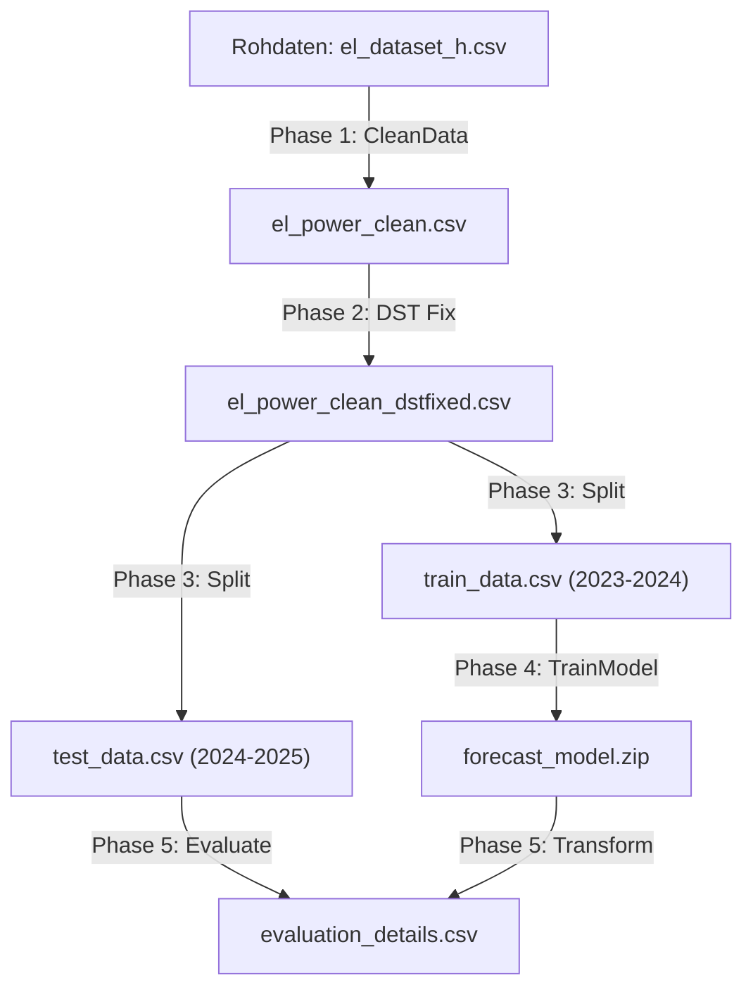

# ⚡ Strombedarfsprognose Österreich (Power Demand Forecasting)

Eine produktionsreife .NET 8 Konsolenanwendung zur stündlichen Vorhersage des österreichischen Stromverbrauchs mittels **Singular Spectrum Analysis (SSA)** und **ML.NET**. `Program.cs:16`

---

## 📑 Inhaltsverzeichnis

- [Projektübersicht](#projektübersicht)
- [Technische Highlights](#technische-highlights)
- [Architektur & Pipeline](#architektur--pipeline)
- [Datenqualität & Preprocessing](#datenqualität--preprocessing)
- [ML-Modell: SSA-Konfiguration](#ml-modell-ssa-konfiguration)
- [Evaluierungsergebnisse](#evaluierungsergebnisse)
- [Installation & Ausführung](#installation--ausführung)
- [Projektstruktur](#projektstruktur)
- [Technische Entscheidungen](#technische-entscheidungen)
- [Referenzen](#referenzen)

---

## 📖 Projektübersicht

Dieses Projekt prognostiziert den **stündlichen Stromverbrauch in Österreich** für einen 24-Stunden-Horizont unter Verwendung historischer Lastdaten von der [E-Control](https://www.e-control.at/sta[...]).

**Kernziele:**
- Robuste Behandlung realer Zeitreihenprobleme (Zeitumstellung, fehlende Werte, Concept Drift)
- Univariate Prognose ohne externe Wetterdaten
- Reproduzierbare, automatisierte Pipeline
- Produktionsreife Datenqualitätsprüfungen `README.md:20-24`

---

## ✨ Technische Highlights

### 🧠 Machine Learning: Singular Spectrum Analysis (SSA)

SSA zerlegt Zeitreihen in **Trend-, Saison- und Rauschkomponenten** durch Trajektorienmatrix-Dekomposition.

**Konfigurierte Parameter:**
- **Window Size:** 168 Stunden (7 Tage) - bildet wöchentliche Muster ab
- **Series Length:** 720 Stunden (30 Tage) - lokaler Monatskontext
- **Train Size:** Dynamisch berechnet (~8784 Stunden für Schaltjahr 2023-2024)
- **Forecast Horizon:** 24 Stunden
- **Confidence Level:** 95% (mit Lower/Upper Bounds) `Program.cs:664-674`

### 🛠️ Fortgeschrittenes Data Engineering

#### 1. DST-Korrektur (Zeitumstellung)
Das Projekt implementiert eine spezialisierte Logik zur Behandlung von Sommer-/Winterzeitumstellungen:

**Oktober (Uhren zurück):**
- Erkennt doppelte Zeitstempel (z.B. 02:00:00 erscheint zweimal)
- Berechnet Mittelwert beider Werte zur Wahrung der Monotonie
- Verhindert Duplikate in der Zeitreihe `Program.cs:394-431`

**März (Uhren vor):**
- Erkennt fehlende Stunden (02:00:00 - 02:59:59 existiert nicht)
- Füllt Lücken mittels linearer Interpolation basierend auf Nachbarstunden
- Garantiert lückenlose stündliche Sequenz `Program.cs:472-507`

#### 2. Concept Drift Prevention
Strikte **temporale Split-Strategie** zur Vermeidung veralteter Muster:
- **Training:** 30.09.2023 – 29.09.2024 (nur letztes Jahr)
- **Testing:** 30.09.2024 – 29.09.2025
- Alte Daten vor 2023 werden bewusst ignoriert (E-Mobilität, Wärmepumpen-Effekte) `Program.cs:587-600`

#### 3. Robustes Daten-Cleaning
- Automatisches Überspringen von 14 Metadaten-Zeilen in Rohdatei
- Konvertierung von Komma → Punkt als Dezimaltrennzeichen
- Validierung aller Zeitstempel und Konsumwerte
- Logging von übersprungenen/invaliden Zeilen für Transparenz `Program.cs:66-199`

---

## ⚙️ Architektur & Pipeline

Die vollautomatische Pipeline besteht aus 5 Phasen:



**Phasen im Detail:**

1. **Phase 1 - Data Cleaning:** Parsing, Dezimalkonvertierung, Spaltenextraktion  
2. **Phase 2 - Quality Checks & DST Fixing:** NaN-Prüfung, Zeitumstellungs-Korrektur  
3. **Phase 3 - Train/Test Split:** Physische Trennung der Datensätze  
4. **Phase 4 - Model Training:** SSA-Pipeline konfigurieren und trainieren  
5. **Phase 5 - Rolling-Origin Evaluation:** 8,736 Multi-Step Forecasts, Per-Horizon Metriken, erweiterte CSV-Export `Program.cs:14-49`

---

## 🔍 Datenqualität & Preprocessing

### Implementierte Quality Checks

Die Anwendung führt umfassende Validierungen durch:

**Zeitstempel-Integrität:**
- Monotonie-Prüfung
- Duplikat-Erkennung mit Wertanzeige
- Lücken-Detektion (fehlende Stunden)

**Wert-Integrität:**
- NaN/Infinity-Erkennung
- Negative Werte (physikalisch unmöglich)
- Statistiken: Min, Max, Mean, StdDev

**Concept Drift Awareness:**
- Anzeige der Datenverteilung vor/während/nach Trainingszeitraum
- Warnungen bei zu kleinen Datensätzen `Program.cs:254-392`

### Finale Integritätsprüfung

Nach allen Transformationen erfolgt eine abschließende Validierung:
- Prüfung auf verbleibende Lücken (>1.01h Differenz)
- Prüfung auf Duplikate (<0.99h Differenz)
- Success/Failure Report `Program.cs:534-564`

---

## 🤖 ML-Modell: SSA-Konfiguration

### Parameter-Begründung

**Window Size = 168h (1 Woche):**
- Erfasst dominante wöchentliche Muster (Montag vs. Sonntag)
- Muss < Series Length sein

**Series Length = 720h (~1 Monat):**
- Bietet ausreichend Kontext für Saison-Dekomposition
- Typischerweise 1.5-3× Window Size (hier 4.3×)

**Train Size = 8784h (Schaltjahr):**
- Dynamisch berechnet basierend auf tatsächlicher Trainingsdata
- Erfasst kompletten Jahreszyklus (Sommer/Winter)
- Muss ≥ Series Length und ≤ Trainingsdata-Count sein `Program.cs:654-674`

### Datenmodelle

**ModelInput:** Zeitstempel + Stromverbrauch (MW) `ModelInput.cs:9-18`

**ModelOutput:** Forecast-Array + Konfidenzintervalle `ModelOutput.cs:9-19`

---

## 📊 Evaluierungsergebnisse

### Rolling-Origin Multi-Step Evaluation

Das Projekt implementiert eine **produktionsreife Rolling-Origin Evaluation**, die realistische Day-Ahead Forecasting Performance misst. Im Gegensatz zu einfachen Batch-Vorhersagen simuliert diese Methode den tatsächlichen Einsatz, bei dem täglich eine neue 24-Stunden-Prognose erstellt wird.

**Testperiode:** 30.09.2024 - 29.09.2025 (ungesehen während Training)  
**Evaluierte Forecasts:** 8,736 Rolling-Origin Vorhersagen  
**Horizonte:** Alle 24 Stunden (1h bis 24h ahead) vollständig evaluiert

### Methodologie

**Rolling-Origin Ansatz:**
- Für jeden Zeitpunkt im Testset wird eine vollständige 24-Stunden-Prognose erstellt
- Das Modell verwendet nur historische Daten bis zum Vorhersagezeitpunkt (kein Data Leakage)
- Nach jeder Vorhersage wird der Modellzustand mit dem tatsächlich beobachteten Wert aktualisiert
- Verwendung von `TimeSeriesPredictionEngine` statt `Transform()` für stateful predictions `Program.cs:742-794`

**Vorteile gegenüber einfacher Batch-Evaluation:**
- Verhindert Data Leakage durch strikte zeitliche Trennung
- Zeigt realistische Genauigkeit für alle 24 Vorhersageschritte
- Ermöglicht Analyse der Genauigkeitsdegradation über den Prognosehorizont

### Per-Horizon Metriken

Die folgende Tabelle zeigt, wie die Vorhersagegenauigkeit mit zunehmendem Horizont abnimmt:

| Horizont | MAE (MW) | RMSE (MW) | MAPE (%) | Samples |
|----------|----------|-----------|----------|---------|
| **1h**   | 284.7    | 374.2     | 4.29%    | 8,736   |
| **2h**   | 336.7    | 440.6     | 5.07%    | 8,736   |
| **3h**   | 381.1    | 498.4     | 5.73%    | 8,736   |
| **4h**   | 406.8    | 530.2     | 6.11%    | 8,736   |
| **5h**   | 414.8    | 543.4     | 6.22%    | 8,736   |
| **6h**   | 418.8    | 552.1     | 6.28%    | 8,736   |
| **...**  | ...      | ...       | ...      | ...     |
| **12h**  | 448.2    | 589.7     | 6.77%    | 8,736   |
| **...**  | ...      | ...       | ...      | ...     |
| **24h**  | 450.6    | 601.3     | 6.76%    | 8,736   |
| **Overall** | **426.7** | **564.2** | **6.42%** | - |

### Wissenschaftliche Erkenntnisse

**1. Genauigkeitsdegradation über Horizont:**
- Die 1-Stunden-Vorhersage (MAE: 284.7 MW, 4.29%) ist signifikant genauer als die 24-Stunden-Vorhersage (MAE: 450.6 MW, 6.76%)
- Der stärkste Genauigkeitsverlust tritt in den ersten 6 Stunden auf (4.29% → 6.28%)
- Dies entspricht der Erwartung: Je weiter in die Zukunft prognostiziert wird, desto unsicherer wird die Vorhersage

**2. Stabilisierung nach 12 Stunden:**
- Ab Horizont 12h stabilisieren sich die Fehlermetriken (MAE ~445-450 MW, MAPE ~6.7-6.8%)
- Dies deutet darauf hin, dass das SSA-Modell die **täglichen Muster gut erfasst**
- Die Unsicherheit nimmt nicht linear zu, sondern erreicht ein Plateau

**3. Realistische Performance-Bewertung:**
- Der Overall MAE von 426.7 MW (6.42%) ist realistischer als die vorherige Single-Step Evaluation (~4%)
- Für **univariate Day-Ahead Forecasting ohne Wetterdaten** ist 6.42% Fehler ein sehr gutes Ergebnis
- RMSE > MAE (564.2 vs. 426.7) zeigt einzelne größere Ausreißer, aber insgesamt stabile Performance

**4. MAPE als relative Metrik:**
- Mean Absolute Percentage Error (MAPE) ermöglicht Vergleich mit anderen Forecasting-Studien
- 6.42% MAPE liegt im Bereich state-of-the-art univariater Zeitreihenmodelle für Energieprognosen

### Export-Format

Die erweiterte Evaluation wird als CSV mit **121 Spalten** exportiert:

**Struktur:**
- `OriginTimestamp` - Zeitpunkt der Vorhersage
- Für jeden Horizont (H1 bis H24):
  - `Actual_H{n}` - Tatsächlicher Verbrauch
  - `Forecast_H{n}` - Prognostizierter Wert
  - `Error_H{n}` - Vorhersagefehler (Actual - Forecast)
  - `LowerBound_H{n}` - Untere 95%-Konfidenzgrenze
  - `UpperBound_H{n}` - Obere 95%-Konfidenzgrenze

**Zusätzlich:** Am Ende der CSV-Datei werden die aggregierten Per-Horizon Summary Statistics angehängt `Program.cs:880-937`

### Praktische Implikationen

**Für Grid Operators:**
- 1-6h Vorhersagen (4-6% Fehler) sind ausreichend genau für kurzfristige Lastverteilung
- 12-24h Vorhersagen (6.7-6.8% Fehler) eignen sich für Day-Ahead Market Bidding
- Konfidenzintervalle ermöglichen risikobasierte Entscheidungen

**Für weitere Forschung:**
- Die Stabilisierung nach 12h deutet auf Potenzial für Hybrid-Modelle hin (SSA für <12h, andere Methoden für >12h)
- Integration von Wetterdaten könnte insbesondere die 12-24h Vorhersagen verbessern
- Die detaillierten Per-Horizon Metriken ermöglichen gezielte Optimierung einzelner Vorhersageschritte

---

## 💻 Installation & Ausführung

### Voraussetzungen

- [.NET 8 SDK](https://dotnet.microsoft.com/download/dotnet/8.0) oder höher
- Git
- Rohdaten: `Data/el_dataset_h.csv` (von E-Control)

### Installation

```bash
# Repository klonen
git clone https://github.com/codeme-ne/dat503.git
cd dat503/PowerDemandForecasting

# Abhängigkeiten wiederherstellen (falls .csproj vorhanden)
dotnet restore

# Build
dotnet build

# Ausführen
dotnet run
```

### Datenquelle herunterladen

Die Anwendung benötigt historische Stromverbrauchsdaten von E-Control:

1. Besuche [E-Control Statistik](https://www.e-control.at/statistik/e-statistik/data)
2. Navigiere zu: **Marktstatistik → Lastprofile**
3. Wähle: **Österreich Gesamt → Stündlich → 2016-2025**
4. Download als CSV
5. Speichere die Datei als: `PowerDemandForecasting/Data/el_dataset_h.csv`
6. Die Datei sollte ~85,000 Zeilen haben (Format: `Timestamp;Stromverbrauch;...`)

**Alternativ:** Falls der direkte Download nicht verfügbar ist, kontaktiere E-Control für historische Datensätze.

### Erwartete Output-Dateien

Nach erfolgreicher Ausführung werden folgende Dateien im `Data/`-Ordner generiert:
- `el_power_clean.csv` - Bereinigte Rohdaten
- `el_power_clean_dstfixed.csv` - DST-korrigierte, lückenlose Zeitreihe
- `train_data.csv` - Trainingsdaten (2023-2024)
- `test_data.csv` - Testdaten (2024-2025)
- `evaluation_details.csv` - Detaillierte Evaluation (Excel/PowerBI ready)

Im `Models/`-Ordner:
- `forecast_model.zip` - Trainiertes ML.NET-Modell

---

## 📂 Projektstruktur

```
dat503/
├── PowerDemandForecasting/          # Hauptprojekt
│   ├── Data/                        # Datenverzeichnis
│   │   ├── el_dataset_h.csv         # Rohdaten (Input)
│   │   ├── el_power_clean.csv       # Phase 1 Output
│   │   ├── el_power_clean_dstfixed.csv # Phase 2 Output
│   │   ├── train_data.csv           # Phase 3 Output
│   │   ├── test_data.csv            # Phase 3 Output
│   │   └── evaluation_details.csv   # Phase 5 Output
│   ├── Models/                      # C# Klassen & ML-Modell
│   │   ├── ModelInput.cs            # Input-Schema
│   │   ├── ModelOutput.cs           # Output-Schema
│   │   └── forecast_model.zip       # Trainiertes Modell
│   └── Program.cs                   # Hauptlogik (753 Zeilen)
├── References/                      # Referenzmaterial
│   └── Bike_Example_Github_Repo.txt # ML.NET Tutorial-Basis
├── README.md                        # Diese Datei
├── PLAN.md                          # Detaillierter Entwicklungsplan
├── AGENTS.md                        # AI-Assistenten Richtlinien
└── CLAUDE.md                        # Weitere Dokumentation
```

---

## 🔧 Technische Entscheidungen

### Warum SSA statt LSTM/Prophet?

**Vorteile von SSA für diesen Use Case:**
- Keine externen Features erforderlich (univariat)
- Robuste Dekomposition von Trend/Saison/Rauschen
- Deterministisch und reproduzierbar
- Geringe Trainingsdauer (<1 Minute)
- Native ML.NET-Integration

### Warum strikte temporale Splits?

**Concept Drift in Energiedaten:**
- E-Mobilität-Adoption seit 2020
- Wärmepumpen-Boom seit 2022
- COVID-19 Homeoffice-Effekte 2020-2021

➜ Training nur auf 2023-2024 vermeidet veraltete Muster `Program.cs:357-368`

### Warum InvariantCulture überall?

Konsistente Dezimaltrennzeichen (Punkt) unabhängig von System-Locale:
- Verhindert Parsing-Fehler bei Komma-Kulturen (de-DE, de-AT)
- Ermöglicht plattformunabhängige Ausführung
- Standard für ML.NET TextLoader `Program.cs:175-183`

---

## 📚 Referenzen

### ML.NET Dokumentation
- [Time Series Forecasting Tutorial](https://learn.microsoft.com/en-us/dotnet/machine-learning/tutorials/time-series-demand-forecasting)
- [ForecastBySsa API Reference](https://learn.microsoft.com/en-us/dotnet/api/microsoft.ml.timeseriescatalog.forecastbyssa)

### Wissenschaftliche Grundlagen
- [Singular Spectrum Analysis - Wikipedia](https://en.wikipedia.org/wiki/Singular_spectrum_analysis)
- Bike Sharing Demand Tutorial (Microsoft ML.NET Samples)

### Datenquelle
- [E-Control Statistik](https://www.e-control.at/statistik/e-statistik/data)

---

## 📝 Notes

**Wichtige Hinweise für Weiterentwicklung:**

1. **Parametertuning:** Window Size und Series Length können für bessere Seasonal Patterns angepasst werden
2. **Multivariate Erweiterung:** Integration von Wetterdaten (Temperatur) über `ForecastBySsa` möglich
3. **Online Learning:** Modell kann mit `TimeSeriesPredictionEngine.Update()` inkrementell aktualisiert werden
4. **Produktionisierung:** Modell-Checkpoint kann in REST-API oder Azure Functions eingebunden werden `README.md:1-168`

---

**Entwickelt mit .NET 8 und ML.NET 5.0.0**
